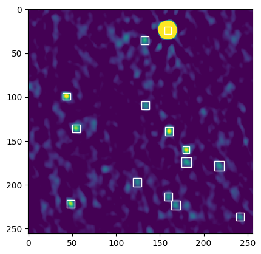
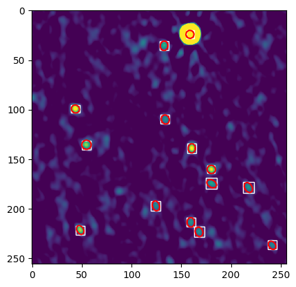

# PyBDSF_to_COCO

Convert a source catalog written by [PyBDSF](https://pybdsf.readthedocs.io) to [COCO](https://cocodataset.org/#home) dataset format. WCS coordinates used in PyBDSF catalogs will be converted to pixel values.

Current limitations:
- Bounding boxes are currently based on source major axis, not on segmentation
- segmentation is determined from ellipse shape with no uncertainties accounted for
- If images are a list of crops, the image shape defaults to shape of first crop

## Usage

If catalog keys don't match those [automatically written by PyBDSF](https://pybdsf.readthedocs.io/en/latest/write_catalog.html), create a dictionary that maps the keys, for example:

```python
keymap = {"RA":"myRA","DEC":"myDEC","Maj":"myMAJ","Min":"myMIN","PA":"myPA"}
```

and save as JSON. Use the argument _--keymap my_keymap.json_ when running the code.

### single image and associated catalog

```bash
pyBDSF_to_COCO.py --image /path/to/fitsfile.fits --catalog /path/to/catalog.txt --output_file /path/to/catalog_coco.json --category_names source
```

### single image, associated catalog, SkyCoords of (bottom left, upper right) cutouts from that image

```bash
pyBDSF_to_COCO.py --image /path/to/fitsfile.fits --catalog /path/to/catalog.txt --output_file /path/to/catalog_coco.json  --crop_coords /path/to/crop_coords.npy --crop_dir /path/to/image/crops --category_names source 
```

### Verify that output JSON and source catalog match

```python
from pyBDSF_to_COCO.utils import plot_image_catalog

plot_image_catalog("image.fits", "annotations_json", bounding_boxes = True, segmentations = False)
```




```python
from pyBDSF_to_COCO.utils import plot_image_catalog

plot_image_catalog("image.fits", "annotations_json", bounding_boxes = True, segmentations = True)
```



## Dependencies
- astropy
- photutils

## Example output

Two sources from a crop of the COSMOS image

```json
{"info": {"year": 2023, "version": "", "description": "test data", "contributer": "yours truly", "url": "https://www.mydata.org", "date_created": "2023-05-01T13:44:18.356"}, 
"images": [{"id": 0, "file_name": "test_image.npy", "width": 4096, "height": 4096, "date_captured": "2023-05-01T13:53:07.536", "license": 1.0, "coco_url": "", "flickr_url": ""}],
"annotations": [{"id": 0, "image_id": 0, "category_id": 1, "iscrowd": 0, "area": 64.0, "bbox": [0, 54, 8, 8], "segmentation": [[0, 59, 0, 58, 0, 57, 0, 56, 0, 55, 1, 54, 2, 54, 3, 53, 4, 53, 5, 54, 6, 54, 6, 55, 7, 56, 7, 57, 7, 58, 7, 59, 7, 60, 6, 61, 5, 61, 4, 62, 3, 62, 2, 61, 1, 61, 0, 60, 0, 59, 0, 59]]}, {"id": 1, "image_id": 0, "category_id": 1, "iscrowd": 0, "area": 64.0, "bbox": [24, 208, 8, 8], "segmentation": [[31, 212, 31, 213, 31, 214, 30, 215, 29, 216, 28, 216, 27, 216, 26, 216, 26, 215, 25, 214, 24, 214, 24, 213, 24, 211, 24, 210, 25, 209, 26, 209, 26, 208, 27, 208, 28, 208, 29, 208, 30, 208, 31, 209, 31, 210, 31, 211, 31, 212, 31, 212]]}],
"categories": [{"id": 1, "name": "source", "supercategory": ""}]} 
```

## Other functions

### Combine catalogs written for each image in a dataset into one large catalog

Make sure all JSON files are in the same directory.

```python
combine_coco("/path/to/my/dir")
```